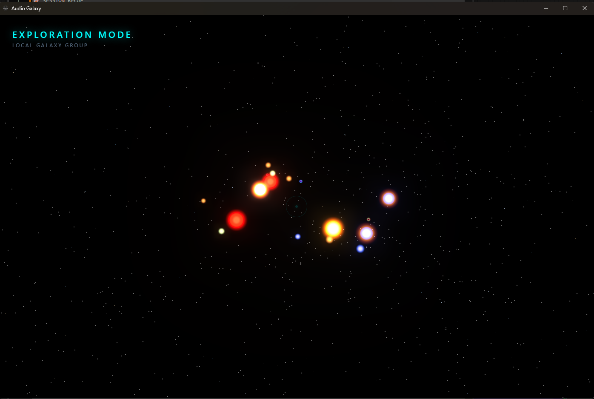
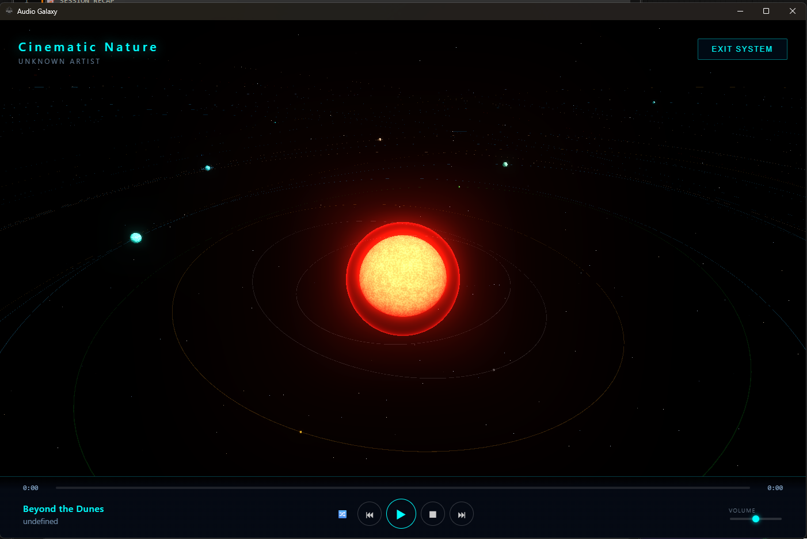
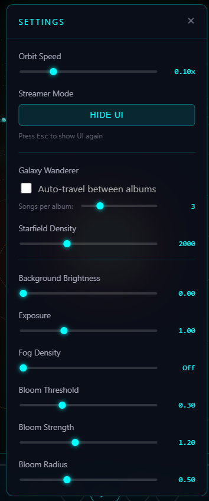

# Kraken Galaxy Music Player


**Kraken Galaxy Music Player** is a next-generation, GPU-accelerated 3D music visualizer and player. It transforms your local music library into a procedural universe where every artist is a star system and every song is a unique, living planet.

## 🌟 Features

*   **GPU-Accelerated Visuals**: Powered by custom GLSL shaders, enabling instant planet generation with infinite detail and animated surfaces (lava flows, gas giant swirls).
*   **Procedural Universe**: Your music defines the cosmos. Planets are generated based on track data, ensuring a unique visual experience for every song.
*   **3D Navigation**: Fly through your music collection with smooth camera controls. Zoom from a galactic view down to the surface of a planet.
*   **Persistent Settings**: Customize your experience with the "Secret Menu" (~ key), including fog density, bloom strength, and orbit speeds. Settings are saved automatically.
*   **Wanderer Mode**: Sit back and let the autopilot guide you through the galaxy, exploring random albums and playing tracks automatically.

## 📸 Gallery

### The Galaxy View
Explore your entire library as a shimmering star cluster.


### Solar Systems
Enter a system to see tracks orbiting their artist-star.


### Custom settings
Fine-tune the visuals with the hidden overlay.


## 🚀 Installation

### Windows
1.  Download the latest installer (`.exe`) from the [Releases](https://github.com/krakenunbound/kraken-galaxy/releases) page.
2.  Run the installer.
3.  Launch **Kraken Galaxy Music Player**.
4.  Select your music folder when prompted.

### Linux / macOS
Currently, you must build from source (see below).

## 🛠 Building from Source

### Prerequisites
*   **Node.js** (v16+)
*   **Rust** (v1.70+)
*   **Visual Studio C++ Build Tools** (Windows only)
*   **WebView2 Runtime** (Windows only, usually installed)

### Setup
1.  Clone the repository:
    ```bash
    git clone https://github.com/krakenunbound/kraken-galaxy.git
    cd kraken-galaxy/tarui
    ```
2.  Install dependencies:
    ```bash
    npm install
    ```
3.  Run in development mode:
    ```bash
    npm run tauri:dev
    ```
4.  Build for production:
    ```bash
    npm run tauri:build
    ```
    The compiled executable/installer will be in `src-tauri/target/release/bundle/`.

## 🎮 Controls

*   **Mouse**: Click to select/travel. Drag to rotate. Scroll to zoom.
*   **~ (Tilde)**: Open/Close Settings Menu.
*   **Esc**: Go Back / Exit System.
*   **Space**: Play/Pause.

## 📄 License
MIT
